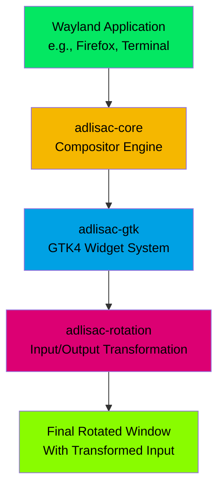

# <span style="color: #04e762;">adlisac</span>

A Wayland window rotation system designed for multi-user collaborative smart desks, enabling individual window rotation without rotating the entire screen.

## Overview

**adlisac** (Application Display Layer Integration System for Adaptive Content) solves the orientation problem on large touchscreen smart desks where users sit
at different sides of the table. When users sit opposite each other, one person sees the content upside down. adlisac allows individual window rotation so
multiple users can interact with applications oriented toward their position.

### <span style="color: #04e762;">Key Features</span>

- **<span style="color: #04e762;">Individual Window Rotation</span>**: Rotate any Wayland application window by any angle
- **<span style="color: #f5b700;">Input Transformation</span>**: Mouse and touch input coordinates are automatically transformed according to window rotation
- **<span style="color: #00a1e4;">Cross-Desktop Compatibility</span>**: Works with Hyprland, Sway, GNOME, and other Wayland compositors
- **<span style="color: #dc0073;">High Performance</span>**: Maintains 60 FPS rendering with hardware acceleration support
- **<span style="color: #89fc00;">Touch Support</span>**: Full touch input support for smart desk surfaces
- **<span style="color: #04e762;">Multi-Window</span>**: Support for multiple rotated windows simultaneously

### <span style="color: #f5b700;">Architecture Overview</span>



## <span style="color: #00a1e4;">Quick Start</span>

### <span style="color: #dc0073;">Installation</span>

```bash
# Clone the repository
git clone https://github.com/smearor/adlisac.git
cd adlisac

# Build the project
cargo build --release

# Install (optional)
cargo install --path .
```

### <span style="color: #89fc00;">Basic Usage</span>

```bash
# Rotate an application by 180 degrees
adlisac --angle 180 -- firefox

# Launch a terminal rotated 90 degrees clockwise
adlisac --angle 90 -- gnome-terminal

# Custom window size with rotation
adlisac --angle 270 --width 800 --height 600 -- kate

# Fullscreen rotated application
adlisac --angle 180 --fullscreen -- vlc
```

### <span style="color: #04e762;">Command Line Options</span>

| Option              | Description                    |
|---------------------|--------------------------------|
| `--angle <DEGREES>` | <span style="color: #f5b700;">Rotation angle (0-360 degrees)</span> |
| `--width <PIXELS>`  | <span style="color: #00a1e4;">Window width</span>                   |
| `--height <PIXELS>` | <span style="color: #dc0073;">Window height</span>                  |
| `--fullscreen`      | <span style="color: #89fc00;">Launch in fullscreen mode</span>      |
| `--maximized`       | <span style="color: #04e762;">Launch maximized</span>               |
| `--no-decoration`   | <span style="color: #f5b700;">Remove window decorations</span>      |
| `--socket <NAME>`   | <span style="color: #00a1e4;">Custom Wayland socket name</span>     |
| `--help`            | <span style="color: #dc0073;">Show all available options</span>     |

## <span style="color: #f5b700;">Architecture</span>

adlisac is built with a modular architecture consisting of four main components:

### <span style="color: #00a1e4;">Core Components</span>

- **<span style="color: #04e762;">adlisac-core</span>**: Wayland compositor functionality for process rendering
- **<span style="color: #f5b700;">adlisac-gtk</span>**: GTK4 widget for compositor rendering (depends on adlisac-core)
- **<span style="color: #00a1e4;">adlisac-rotation</span>**: Generic GTK4 widget for rotating any GTK4 widget with input/output transformation
- **<span style="color: #dc0073;">adlisac-wrapper</span>**: CLI application providing the complete window solution

### <span style="color: #89fc00;">Technology Stack</span>

- **<span style="color: #04e762;">Rust Edition 2021</span>**: Modern Rust with latest language features
- **<span style="color: #f5b700;">GTK4</span>**: Cross-platform GUI framework
- **<span style="color: #00a1e4;">Smithay</span>**: Wayland compositor framework
- **<span style="color: #dc0073;">Wayland Protocol</span>**: Full compliance with Wayland standards
- **<span style="color: #89fc00;">Hardware Acceleration</span>**: DMA-BUF support for GPU rendering

## <span style="color: #00a1e4;">Development</span>

### <span style="color: #dc0073;">Prerequisites</span>

- <span style="color: #04e762;">Rust 1.70+</span> with Edition 2021 support
- <span style="color: #f5b700;">GTK4</span> development libraries
- <span style="color: #00a1e4;">Wayland</span> development libraries
- <span style="color: #dc0073;">Linux</span> with Wayland compositor (Hyprland, Sway, GNOME, etc.)

### <span style="color: #89fc00;">Building from Source</span>

```bash
# Install dependencies (Ubuntu/Debian)
sudo apt update
sudo apt install build-essential pkg-config libgtk-4-dev libwayland-dev

# Clone and build
git clone https://github.com/smearor/adlisac.git
cd adlisac
cargo build --release
```

### <span style="color: #04e762;">Development Workflow</span>

```bash
# <span style="color: #f5b700;">Run tests</span>
cargo test

# <span style="color: #00a1e4;">Format code</span>
cargo fmt

# <span style="color: #dc0073;">Lint code</span>
cargo clippy

# <span style="color: #89fc00;">Security audit</span>
cargo audit

# <span style="color: #04e762;">Run with debug output</span>
RUST_LOG=debug cargo run -- --angle 180 -- firefox
```

### <span style="color: #f5b700;">Project Structure</span>

```
adlisac/
├── adlisac-core/       # Core compositor functionality
├── adlisac-gtk/        # GTK4 integration widgets
├── adlisac-rotation/   # Generic rotation widget
├── adlisac-wrapper/    # CLI application
```

## <span style="color: #00a1e4;">Use Cases</span>

### <span style="color: #dc0073;">Smart Desk Collaboration</span>

Perfect for table-top smart desks where multiple users collaborate from different sides:

- **<span style="color: #04e762;">Design Reviews</span>**: Rotate design tools toward each participant
- **<span style="color: #f5b700;">Programming Pairs</span>**: Share IDE windows with proper orientation
- **<span style="color: #00a1e4;">Presentations</span>**: Rotate slides toward audience members
- **<span style="color: #dc0073;">Data Analysis</span>**: Multiple analysts viewing dashboards from different positions

### <span style="color: #89fc00;">Digital Signage</span>

- **<span style="color: #04e762;">Retail Displays</span>**: Rotate content for different viewing angles
- **<span style="color: #f5b700;">Information Kiosks</span>**: Adaptive orientation for accessibility
- **<span style="color: #00a1e4;">Trade Shows</span>**: Multi-directional content presentation

## <span style="color: #dc0073;">Performance</span>

- **<span style="color: #04e762;">Rendering</span>**: 60 FPS smooth rendering
- **<span style="color: #f5b700;">Input Latency</span>**: < 16ms input processing delay
- **<span style="color: #00a1e4;">Memory Efficiency</span>**: Optimized for embedded applications
- **<span style="color: #dc0073;">Hardware Acceleration</span>**: DMA-BUF GPU rendering support

## <span style="color: #89fc00;">Troubleshooting</span>

### <span style="color: #04e762;">Common Issues</span>

**<span style="color: #f5b700;">Application doesn't start</span>**:

```bash
# Check Wayland display
echo $WAYLAND_DISPLAY

# Try with custom socket
adlisac --socket wayland-1 --angle 180 -- firefox
```

**<span style="color: #00a1e4;">Touch input not working</span>**:

```bash
# Check touch device support
libinput list-devices

# Ensure GTK4 touch support is enabled
export GDK_CORE_DEVICE_EVENTS=1
```

**<span style="color: #dc0073;">Performance issues</span>**:

```bash
# Enable hardware acceleration
export ADLISAC_HARDWARE_ACCEL=1

# Check GPU driver support
glxinfo | grep "OpenGL renderer"
```

### <span style="color: #89fc00;">Debug Mode</span>

Enable debug logging for troubleshooting:

```bash
RUST_LOG=debug adlisac --angle 180 -- firefox
```

### <span style="color: #04e762;">Development Setup</span>

```bash
# Fork the repository
git clone https://github.com/your-username/adlisac.git
cd adlisac

# Add upstream remote
git remote add upstream https://github.com/smearor/adlisac.git

# Create feature branch
git checkout -b feature/your-feature-name

# Make changes and test
cargo test
cargo clippy

# Submit pull request
```

See [CODE_OF_CONDUCT.md](CODE_OF_CONDUCT.md) for community guidelines.

## <span style="color: #f5b700;">Security</span>

For security vulnerability reporting, please email **info@reactive-graph.io** instead of filing public issues.

See [SECURITY.md](SECURITY.md) for our security policy.

## <span style="color: #00a1e4;">License</span>

This project is licensed under the MIT License - see the [LICENSE.md](LICENSE.md) file for details.

## <span style="color: #dc0073;">Changelog</span>

See [CHANGELOG.md](CHANGELOG.md) for version history and changes.

## <span style="color: #89fc00;">Support</span>

- **<span style="color: #04e762;">Issues</span>**: [GitHub Issues](https://github.com/smearor/adlisac/issues)
- **<span style="color: #f5b700;">Discussions</span>**: [GitHub Discussions](https://github.com/smearor/adlisac/discussions)
- **<span style="color: #00a1e4;">Email</span>**: info@reactive-graph.io

## <span style="color: #dc0073;">Acknowledgments</span>

- <span style="color: #89fc00;">Idea and inspiration</span> from [Casilda](https://gitlab.gnome.org/jpu/casilda)
- <span style="color: #04e762;">Built with</span> [Smithay](https://smithay.github.io/smithay/) Wayland compositor framework
- <span style="color: #f5b700;">Uses</span> [GTK4](https://gtk-rs.org/gtk4-rs/stable/latest/docs/gtk4/) for GUI widgets
- <span style="color: #00a1e4;">Inspired by</span> the need for collaborative smart desk environments

---

# <span style="color: #04e762;">adlisac</span> - <span style="color: #f5b700;">Making collaborative smart desks truly collaborative</span>.
