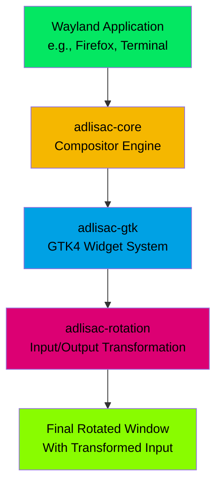

# <span style="color: #04e762;">adlisac</span>

A Wayland window rotation system designed for multi-user collaborative smart desks, enabling individual window rotation without rotating the entire screen.

## Overview

**adlisac** (Application Display Layer Integration System for Adaptive Content) solves the orientation problem on large touchscreen smart desks where users sit
at different sides of the table. When users sit opposite each other, one person sees the content upside down. adlisac allows individual window rotation so
multiple users can interact with applications oriented toward their position.

### Key Features

- **Individual Window Rotation**: Rotate any Wayland application window by any angle
- **Input Transformation**: Mouse and touch input coordinates are automatically transformed according to window rotation
- **Cross-Desktop Compatibility**: Works with Hyprland, Sway, GNOME, and other Wayland compositors
- **High Performance**: Maintains 60 FPS rendering with hardware acceleration support
- **Touch Support**: Full touch input support for smart desk surfaces
- **Multi-Window**: Support for multiple rotated windows simultaneously

### <span style="color: #f5b700;">Architecture Overview</span>



## <span style="color: #00a1e4;">Quick Start</span>

### <span style="color: #dc0073;">Installation</span>

```bash
# Clone the repository
git clone https://github.com/smearor/adlisac.git
cd adlisac

# Build the project
cargo build --release

# Install (optional)
cargo install --path .
```

### <span style="color: #89fc00;">Basic Usage</span>

```bash
# Rotate an application by 180 degrees
adlisac --angle 180 -- firefox

# Launch a terminal rotated 90 degrees clockwise
adlisac --angle 90 -- gnome-terminal

# Custom window size with rotation
adlisac --angle 270 --width 800 --height 600 -- kate

# Fullscreen rotated application
adlisac --angle 180 --fullscreen -- vlc
```

### <span style="color: #04e762;">Command Line Options</span>

| Option              | Description                    |
|---------------------|--------------------------------|
| `--angle <DEGREES>` | Rotation angle (0-360 degrees) |
| `--width <PIXELS>`  | Window width                   |
| `--height <PIXELS>` | Window height                  |
| `--fullscreen`      | Launch in fullscreen mode      |
| `--maximized`       | Launch maximized               |
| `--no-decoration`   | Remove window decorations      |
| `--socket <NAME>`   | Custom Wayland socket name     |
| `--help`            | Show all available options     |

## <span style="color: #f5b700;">Architecture</span>

adlisac is built with a modular architecture consisting of four main components:

### Core Components

- **adlisac-core**: Wayland compositor functionality for process rendering
- **adlisac-gtk**: GTK4 widget for compositor rendering (depends on adlisac-core)
- **adlisac-rotation**: Generic GTK4 widget for rotating any GTK4 widget with input/output transformation
- **adlisac-wrapper**: CLI application providing the complete window solution

### Technology Stack

- **Rust Edition 2021**: Modern Rust with latest language features
- **GTK4**: Cross-platform GUI framework
- **Smithay**: Wayland compositor framework
- **Wayland Protocol**: Full compliance with Wayland standards
- **Hardware Acceleration**: DMA-BUF support for GPU rendering

## <span style="color: #00a1e4;">Development</span>

### Prerequisites

- Rust 1.87+
- GTK4 development libraries
- Wayland development libraries
- Linux with Wayland compositor (Hyprland, Sway, GNOME, etc.)

### <span style="color: #89fc00;">Building from Source</span>

```bash
# Install dependencies (Ubuntu/Debian)
sudo apt update
sudo apt install build-essential pkg-config libgtk-4-dev libwayland-dev

# Clone and build
git clone https://github.com/smearor/adlisac.git
cd adlisac
cargo build --release
```

### Development Workflow

```bash
# Run tests
cargo test

# Format code
cargo fmt

# Lint code
cargo clippy

# Security audit
cargo audit

# Run with debug output
RUST_LOG=debug cargo run -- --angle 180 -- firefox
```

### <span style="color: #f5b700;">Project Structure</span>

```
adlisac/
├── adlisac-core/       # Core compositor functionality
├── adlisac-gtk/        # GTK4 integration widgets
├── adlisac-rotation/   # Generic rotation widget
├── adlisac-wrapper/    # CLI application
```

## <span style="color: #00a1e4;">Use Cases</span>

### Smart Desk Collaboration

Perfect for table-top smart desks where multiple users collaborate from different sides:

- **Design Reviews**: Rotate design tools toward each participant
- **Programming Pairs**: Share IDE windows with proper orientation
- **Presentations**: Rotate slides toward audience members
- **Data Analysis**: Multiple analysts viewing dashboards from different positions

### Digital Signage

- **Retail Displays**: Rotate content for different viewing angles
- **Information Kiosks**: Adaptive orientation for accessibility
- **Trade Shows**: Multi-directional content presentation

## Performance

- **Rendering**: 60 FPS smooth rendering
- **Input Latency**: < 16ms input processing delay
- **Memory Efficiency**: Optimized for embedded applications
- **Hardware Acceleration**: DMA-BUF GPU rendering support

## <span style="color: #89fc00;">Troubleshooting</span>

### Common Issues

**Application doesn't start**:

```bash
# Check Wayland display
echo $WAYLAND_DISPLAY

# Try with custom socket
adlisac --socket wayland-1 --angle 180 -- firefox
```

**Touch input not working**:

```bash
# Check touch device support
libinput list-devices

# Ensure GTK4 touch support is enabled
export GDK_CORE_DEVICE_EVENTS=1
```

**Performance issues**:

```bash
# Enable hardware acceleration
export ADLISAC_HARDWARE_ACCEL=1

# Check GPU driver support
glxinfo | grep "OpenGL renderer"
```

### Debug Mode

Enable debug logging for troubleshooting:

```bash
RUST_LOG=debug adlisac --angle 180 -- firefox
```

### Development Setup

```bash
# Fork the repository
git clone https://github.com/your-username/adlisac.git
cd adlisac

# Add upstream remote
git remote add upstream https://github.com/smearor/adlisac.git

# Create feature branch
git checkout -b feature/your-feature-name

# Make changes and test
cargo test
cargo clippy

# Submit pull request
```

See [CODE_OF_CONDUCT.md](CODE_OF_CONDUCT.md) for community guidelines.

## Security

For security vulnerability reporting, please email **info@reactive-graph.io** instead of filing public issues.

See [SECURITY.md](SECURITY.md) for our security policy.

## License

This project is licensed under the MIT License - see the [LICENSE.md](LICENSE.md) file for details.

## Changelog

See [CHANGELOG.md](CHANGELOG.md) for version history and changes.

## Support

- **Issues**: [GitHub Issues](https://github.com/smearor/adlisac/issues)
- **Discussions**: [GitHub Discussions](https://github.com/smearor/adlisac/discussions)
- **Email**: info@reactive-graph.io

## Acknowledgments

- Idea and inspiration from [Casilda](https://gitlab.gnome.org/jpu/casilda)
- Built with [Smithay](https://smithay.github.io/smithay/) Wayland compositor framework
- Uses [GTK4](https://gtk-rs.org/gtk4-rs/stable/latest/docs/gtk4/) for GUI widgets
- Inspired by the need for collaborative smart desk environments

---

# adlisac - Making collaborative smart desks truly collaborative.
